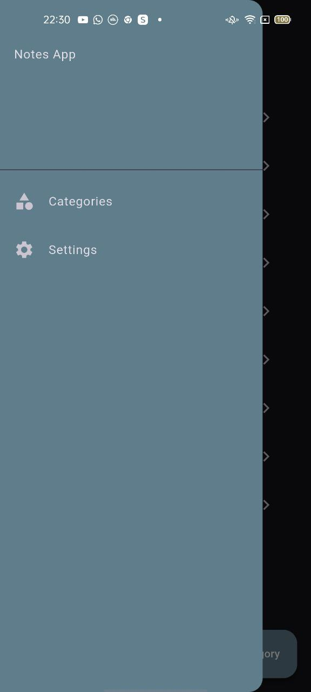
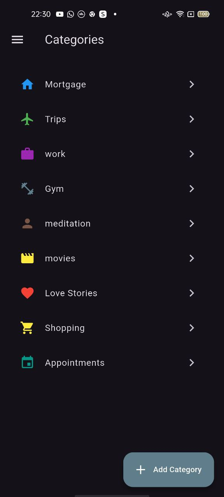
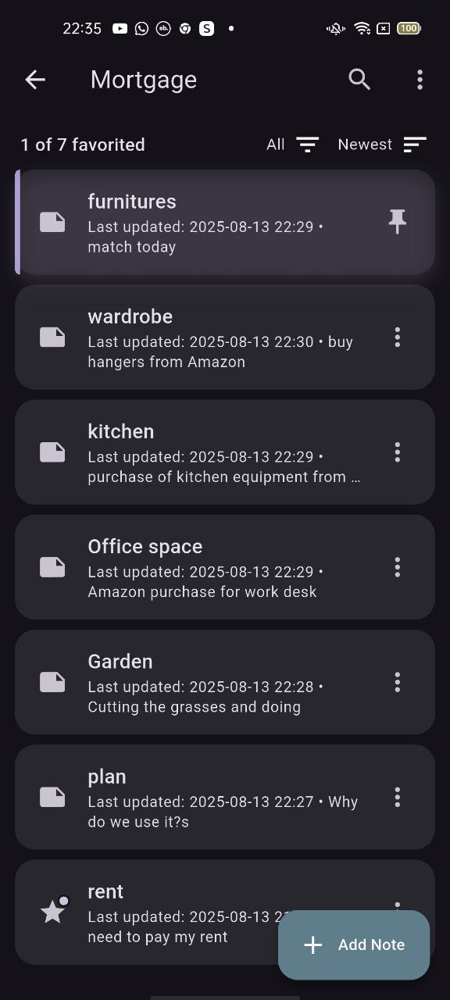
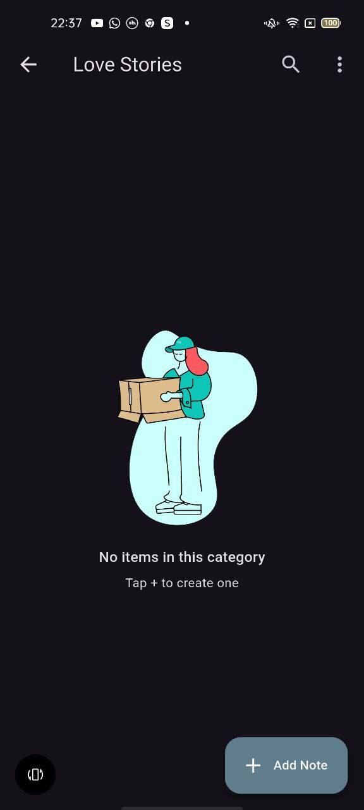

# 📝 Notes App

A modern Flutter **Notes application** with **Hive local storage**, **category management**, and **beautiful animations**.  
Built as part of my Flutter learning journey and portfolio.

---

## ✨ Features
- 📂 Create, edit, and delete categories  
- 📝 Add, edit, pin, favorite, and delete notes  
- 🔍 Live search within a category (filters as you type)  
- ⭐ Favorites filter  
- 📅 Last updated date display under each note  
- 📌 Pinned notes stay at the top of the list  
- 🗑 Multi-select delete for quick cleanup  
- 🖼 Lottie animations for empty states & delete confirmation  
- 🌙 Dark mode (system-based)

---

## 📸 Screenshots

| Drawer | Categories | Notes List | Empty Notes |
|--------|------------|------------|-------------|
|  |  |  |  |

---

## 🎥 Demo

  

[▶ Watch the full demo video](assets/animations/screenshots/demo.mp4)

## 🚀 Getting Started

### 1️⃣ Clone the repository
```bash
git clone https://github.com/Flexydea/notes_app.git
cd notes_app